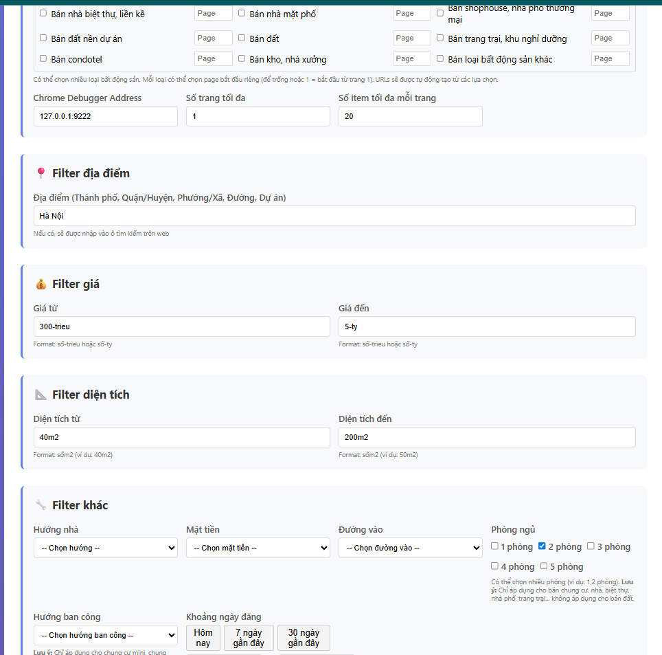

# Batdongsan Scraper

Web scraper cho batdongsan.com.vn sử dụng Selenium với Chrome remote debugging.

## Cấu trúc dự án

```
batdongsan/
├── scraper/              # Package chính
│   ├── __init__.py
│   ├── config.py         # Cấu hình (URLs, timeouts, paths)
│   ├── browser.py        # Khởi tạo Chrome driver
│   ├── storage.py        # Load/save JSON results
│   ├── utils.py          # Helper functions
│   ├── runner.py         # Module chung chứa logic scraping (tái sử dụng)
│   └── collectors/       # Logic scraping
│       ├── __init__.py
│       ├── listing.py    # Thu thập danh sách từ trang list
│       └── detail.py     # Trích xuất chi tiết từ trang detail
├── craw/
│   └── play_batdongsan.py  # Script CLI (sử dụng scraper.runner)
├── app.py                 # Flask web app (khuyến nghị)
├── crawler_runner.py      # Wrapper cho web interface (sử dụng scraper.runner)
├── templates/
│   └── index.html        # Web interface form
├── output/                # Kết quả JSON theo tháng/ngày
│   └── YYYY-MM/
│       └── YYYY-MM-DD.json
├── screenshots_blocked/   # Screenshot khi phát hiện CAPTCHA
└── pyproject.toml         # Dependencies (Poetry)
```

## Yêu cầu

- Python 3.10+ (hoặc 3.14+ theo pyproject.toml)
- Chrome/Chromium với remote debugging enabled
- Dependencies: `selenium`, `requests`, `flask` (xem `pyproject.toml`)

## Cài đặt

```bash
# Sử dụng Poetry (khuyến nghị)
poetry install

# Hoặc pip
pip install selenium requests
```

## Cách sử dụng

### Cách 1: Sử dụng Web Interface (Khuyến nghị)

1. **Khởi động Chrome với remote debugging**

```bash
# Windows
# Tìm vị trí chrome.exe bằng lệnh: where chrome
# Hoặc sử dụng: "C:\Program Files\Google\Chrome\Application\chrome.exe"
chrome.exe --remote-debugging-port=9222 --user-data-dir="C:/chrome-session"

# Linux/Mac
google-chrome --remote-debugging-port=9222
# hoặc
chromium --remote-debugging-port=9222
```

2. **Khởi động Flask web app**

```bash
# Từ thư mục gốc
python app.py
```

3. **Mở trình duyệt và truy cập**

```
http://127.0.0.1:5000
```

4. **Điền form filter và config:**
   - Chọn loại bất động sản (có thể chọn nhiều loại)
   - Chọn page bắt đầu cho mỗi loại (để trống hoặc 1 = bắt đầu từ trang 1)
   - Điền các filter tìm kiếm (địa điểm, giá, diện tích, hướng, phòng ngủ, v.v.)
   - Click "Bắt đầu Crawl"

### Cách 2: Chạy trực tiếp script

```bash
# Từ thư mục gốc
python craw/play_batdongsan.py
```

## Cấu hình

### Cấu hình qua Web Interface (Khuyến nghị)

Tất cả cấu hình có thể được thực hiện qua web interface tại `http://127.0.0.1:5000`:

- **Loại bất động sản**: Chọn từ 12 loại có sẵn (checkbox)
- **Page bắt đầu**: Nhập số page cho mỗi loại (để trống = page 1)
- **Chrome Debugger Address**: Mặc định `127.0.0.1:9222`
- **Số trang tối đa**: Mặc định 5
- **Số item tối đa mỗi trang**: Mặc định 20
- **Các filter**: Địa điểm, giá, diện tích, hướng nhà, mặt tiền, đường vào, phòng ngủ, hướng ban công, ngày đăng

### Cấu hình trong code

Chỉnh sửa các hằng số trong `scraper/config.py` nếu muốn thay đổi mặc định:

- `DEBUGGER_ADDRESS`: Địa chỉ Chrome debugger (mặc định: "127.0.0.1:9222")
- `BASE_URL`: URL trang list mặc định (mặc định: `"https://batdongsan.com.vn/ban-dat"`)
- `MAX_PAGES`: Số trang tối đa (mặc định: 5)
- `MAX_ITEMS_PER_PAGE`: Số item tối đa mỗi trang (mặc định: 20)
- `PAGE_COOLDOWN_SECONDS`: Thời gian chờ giữa các trang (mặc định: 300s = 5 phút)
- `OUTPUT_DIR`: Thư mục lưu kết quả (mặc định: "output")
- `OUTPUT_DIR_FILTER`: Thư mục lưu kết quả có filter (mặc định: "output/output_filtered")
- `SCREENSHOT_DIR`: Thư mục lưu screenshot CAPTCHA (mặc định: "screenshots_blocked")

## Dữ liệu thu thập

Mỗi item trong JSON output chứa:
## Thông tin cơ bản

- `real_estate_code`: Mã tin đăng (PID)

- `title`: Tiêu đề tin đăng

- `content`: Nội dung mô tả chi tiết

- `status`: Trạng thái tin đăng (1 = hoạt động)

## Thông tin danh mục & loại hình

- `real_estate_type_id`: ID loại bất động sản

- `sale_type`: Loại giao dịch (sell / rent)

- `demand_id`: ID nhu cầu

## Thông tin vị trí

- `province_id`: ID tỉnh/thành phố

- `district_id`: ID quận/huyện

- `ward_id`: ID phường/xã (có thể null)

- `address_detail`: Địa chỉ dạng văn bản

- `lat_long`: Tọa độ dạng "lat,lng"

## Thông tin giá và diện tích

- `price`: Giá tổng (đơn vị VND, kiểu số nguyên)

- `price_unit`: Đơn vị giá (1 = tổng, 2 = theo m²)

- `area`: Diện tích số (float)

- `area_unit`: "m2"

## Hình ảnh

- `images`: Danh sách URL ảnh (array)

## Thông tin liên hệ

- `contact_type`: Loại người bán (1 = môi giới, 2 = chính chủ)

- `contact_name`: Tên người liên hệ

- `contact_phone_number`: Số điện thoại

## Thông tin pháp lý

- `infomation_legal_docs_id`: ID loại giấy tờ pháp lý

## Thông tin khác

- `other_info.pid`: Mã tin (trùng real_estate_code)

- `other_info.href`: URL chi tiết bài đăng

## Tính năng

### Web Interface
- ✅ **Giao diện web hiện đại**: Giao diện web đẹp mắt, dễ sử dụng để cấu hình và điều khiển crawler
- ✅ **Real-time status**: Theo dõi tiến trình crawler real-time (trang hiện tại, số items, URL đang xử lý)
- ✅ **Download kết quả**: Tự động tạo link download file JSON sau khi hoàn thành
- ✅ **Long polling**: Cập nhật trạng thái tự động không cần refresh trang

### Chọn loại bất động sản
- ✅ **12 loại bất động sản**: Chọn từ danh sách checkbox (chung cư, nhà riêng, biệt thự, đất, shophouse, condotel, kho xưởng, trang trại, v.v.)
- ✅ **Page bắt đầu riêng**: Mỗi loại bất động sản có thể chọn page bắt đầu riêng (ví dụ: bán đất từ page 5, bán nhà từ page 1)
- ✅ **Nhiều loại cùng lúc**: Có thể chọn nhiều loại bất động sản để scrape cùng lúc

### Filter tìm kiếm
- ✅ **Filter địa điểm**: Tự động nhập vào ô tìm kiếm trên website (thành phố, quận/huyện, phường/xã, đường, dự án)
- ✅ **Filter giá**: Khoảng giá từ - đến (format: số-trieu hoặc số-ty)
- ✅ **Filter diện tích**: Khoảng diện tích từ - đến (format: sốm2)
- ✅ **Filter hướng nhà**: Bắc, Nam, Đông, Tây, Đông Bắc, Đông Nam, Tây Bắc, Tây Nam
- ✅ **Filter mặt tiền**: Tất cả, Dưới 5m, 5-7m, 7-10m, 10-12m, 12-15m, Trên 12m
- ✅ **Filter đường vào**: Tất cả, Dưới 5m, 5-7m, 7-10m, 10-12m, 12-15m, Trên 12m
- ✅ **Filter phòng ngủ**: Chọn nhiều phòng (1,2,3,4,5 phòng) - chỉ áp dụng cho chung cư, nhà, biệt thự, nhà phố, trang trại (không áp dụng cho bán đất)
- ✅ **Filter hướng ban công**: Đông, Tây, Nam, Bắc, Đông Bắc, Tây Bắc, Tây Nam, Đông Nam - chỉ áp dụng cho chung cư mini, chung cư (không áp dụng cho bán đất)
- ✅ **Filter ngày đăng**: Khoảng ngày đăng từ - đến, có nút quick select (hôm nay, 7 ngày, 30 ngày)

### Tính năng kỹ thuật
- ✅ **Code tái sử dụng**: Logic scraping được tập trung trong `scraper/runner.py`, cả CLI và Web đều dùng chung, dễ bảo trì
- ✅ **Tránh trùng lặp**: Load dữ liệu đã scrape từ các file JSON trước đó, tự động bỏ qua item đã có (dựa trên `pid` và `href`)
- ✅ **Xử lý CAPTCHA**: Tự động phát hiện và chụp screenshot khi gặp CAPTCHA
- ✅ **Hỗ trợ nhiều URLs**: Có thể scrape từ nhiều URL cùng lúc, lưu vào cùng một file
- ✅ **Pagination**: Tự động chuyển trang, bỏ qua trang trùng nhiều
- ✅ **Error handling**: Xử lý lỗi gracefully, tiếp tục với item tiếp theo khi có lỗi
- ✅ **Human-like behavior**: Random sleep, scroll tự nhiên để tránh bị phát hiện
- ✅ **Tự động lưu**: Lưu dữ liệu sau mỗi trang để tránh mất dữ liệu
- ✅ **Trích xuất đầy đủ**: Lấy tất cả thông tin chi tiết, hình ảnh, tọa độ bản đồ
- ✅ **Modular design**: Dễ bảo trì và mở rộng
- ✅ **File output có filter**: Khi có filter, file output được lưu vào `output_filtered/` với tên file chứa thông tin filter

## Lưu ý

### Về Filter
- **Filter phòng ngủ**: Chỉ áp dụng cho bán chung cư, nhà, biệt thự, nhà phố, trang trại... **KHÔNG** áp dụng cho bán đất
- **Filter hướng ban công**: Chỉ áp dụng cho chung cư mini, chung cư... **KHÔNG** áp dụng cho bán đất
- **Filter ngày đăng**: Nếu chỉ chọn "Từ ngày" mà không chọn "Đến ngày", hệ thống sẽ tự động set "Đến ngày" = hôm nay

### Về File Output
- Script sẽ tự động tạo thư mục `output/YYYY-MM/` và lưu file `YYYY-MM-DD.json` (khi không có filter)
- Khi có filter, file sẽ được lưu vào `output/output_filtered/YYYY-MM/` với tên file chứa thông tin filter (ví dụ: `2025-11-21_location_Hồ_Chí_Minh_price_from_300-trieu_price_to_5-ty.json`)
- Nếu chọn nhiều loại bất động sản, script sẽ scrape từng URL tuần tự và lưu tất cả vào cùng một file JSON
- Script tự động tránh trùng lặp dữ liệu dựa trên `pid` và `href`

### Về Page bắt đầu
- Nếu không nhập page hoặc nhập 1, URL sẽ là: `https://batdongsan.com.vn/ban-dat`
- Nếu nhập page > 1, URL sẽ là: `https://batdongsan.com.vn/ban-dat/p2` (ví dụ page 2)
- Mỗi loại bất động sản có thể có page bắt đầu riêng

### Về Xử lý lỗi
- Nếu phát hiện CAPTCHA, screenshot sẽ được lưu vào `screenshots_blocked/`
- Script có thể dừng sớm nếu không tìm thấy item mới hoặc hết trang
- Nhấn `Ctrl+C` hoặc click nút "Dừng" trên web interface để dừng an toàn, dữ liệu đã scrape sẽ được lưu
- Dữ liệu được lưu tự động sau mỗi trang để tránh mất dữ liệu khi có lỗi

## Troubleshooting

### Lỗi "No module named 'scraper'"
- Đảm bảo chạy script từ thư mục gốc của project
- Script tự động thêm project root vào `sys.path`

### Chrome không kết nối được
- Kiểm tra Chrome đã khởi động với `--remote-debugging-port=9222`
- Kiểm tra firewall không chặn port 9222

### Không lấy được số điện thoại
- Một số trang có thể yêu cầu tương tác thủ công
- Số điện thoại có thể bị ẩn hoặc yêu cầu đăng nhập

## License

MIT

